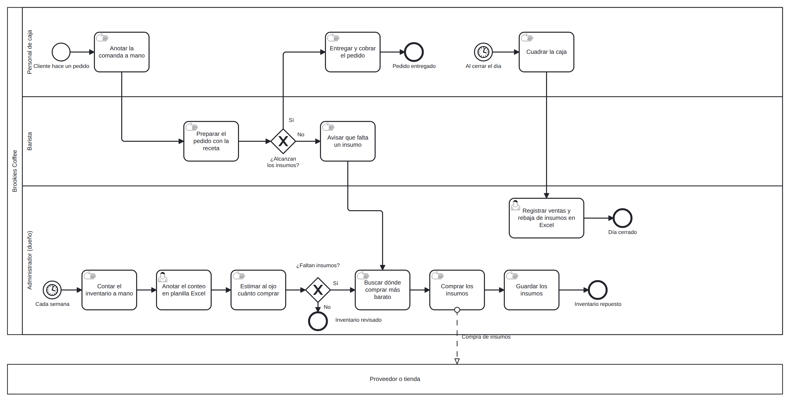

# Proceso de negocio — AS-IS

<!-- BORRAR ESTOS COMENTARIOS AL FINALIZAR.
PENDIENTE (decisión del equipo): el alcance es solo gestión de inventario. Propuesta: macro-proceso "Operación de la cafetería" → proceso específico "Control y reabastecimiento de inventario de insumos", con el pedido confirmado como evento que lo dispara (evento de inicio), sin modelar la toma de pedido ni el pago. Definir además si el AS-IS es la operación actual real o la operación manual proyectada (el local aún no opera oficialmente; declararlo en la ficha). Confirmar con el profesor.
Recordar: pool, carriles, eventos de inicio y fin, compuertas, y tareas marcadas como User, Service o Manual. Exportar PNG y .bpmn a ./diagramas/. Asignar un ID a cada actividad (A01, A02, ...) para poder trazarlas en 02, 03 y 04. -->

## Macro-proceso y proceso específico
[Macro-proceso] → [Proceso específico que se modela]

## Objetivo de negocio del proceso
[Descripción]

## Participantes y sus objetivos
| Participante | Objetivo en el proceso |
|---------------|------------------------|
| [Rol 1] | [Objetivo] |
| [Rol 2] | [Objetivo] |

## Diagrama AS-IS

Archivo fuente: [`./diagramas/as-is.bpmn`](./diagramas/as-is.bpmn)
Nota: distingan tareas de usuario, de servicio y manuales con el marcador correspondiente.

## Problemas identificados
- [Problema 1, asociado al objetivo de un participante]
- [Problema 2]
