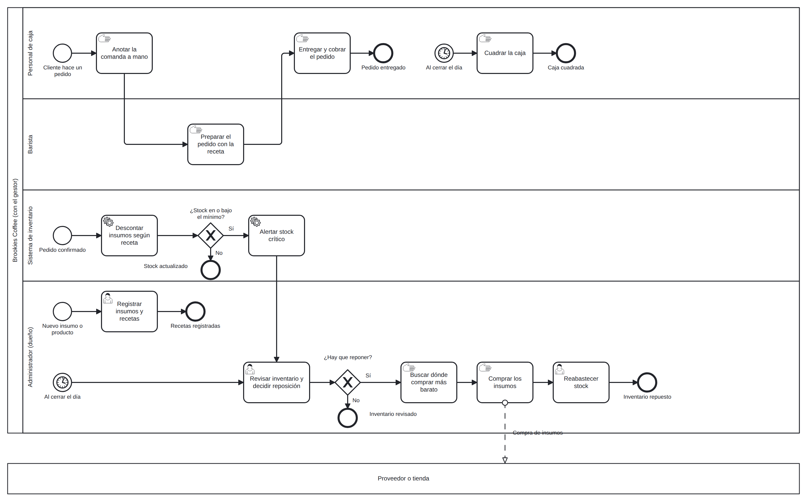

# Análisis de rediseño y propuesta TO-BE

<!-- BORRAR ESTOS COMENTARIOS AL FINALIZAR.
Heurísticas: usar el catálogo de Reijers & Mansar (2005), por ejemplo task automation, task elimination, control addition, integration, buffering, contact reduction. Citar el nombre exacto de la heurística.
La tabla "Actividades que cambian" es la base de 03 y 04: los nombres de actividad deben ser idénticos en los tres documentos. Al cerrarla, reemplazar los nombres marcados (prov.) en 03-requisitos.md.
Actividades TO-BE provisorias usadas en 03: ver el comentario al inicio de 03-requisitos.md. -->

## Mejoras identificadas por participante
| Participante | Objetivo | Problema | Mejora deseada |
|----------------|----------|----------|-----------------|
| [Rol] | [Objetivo] | [Problema] | [Mejora] |

## Iniciativas de rediseño
### Iniciativa 1
- Actividad(es) del AS-IS que afecta: [tarea/actor]
- Heurística aplicada: [nombre de la mejor práctica]
- Objetivo o mejora que resuelve: [cuál]
- Efecto esperado (tiempo/costo/calidad/flexibilidad): [descripción]

## Diagrama TO-BE

Archivo fuente: [`./diagramas/to-be.bpmn`](./diagramas/to-be.bpmn)
Nota: distingan tareas de usuario, de servicio y manuales con el marcador correspondiente.

## Actividades que cambian del AS-IS al TO-BE
| Actividad en el AS-IS | Actividad en el TO-BE | Qué cambia |
|-------------------------|--------------------------|------------|
| [Actividad] | [Actividad] | [Descripción del cambio] |

Esta tabla es la que usarán en 03-requisitos.md y 04-historias-usuario.md para asociar cada requisito e historia a la actividad que cambia.
