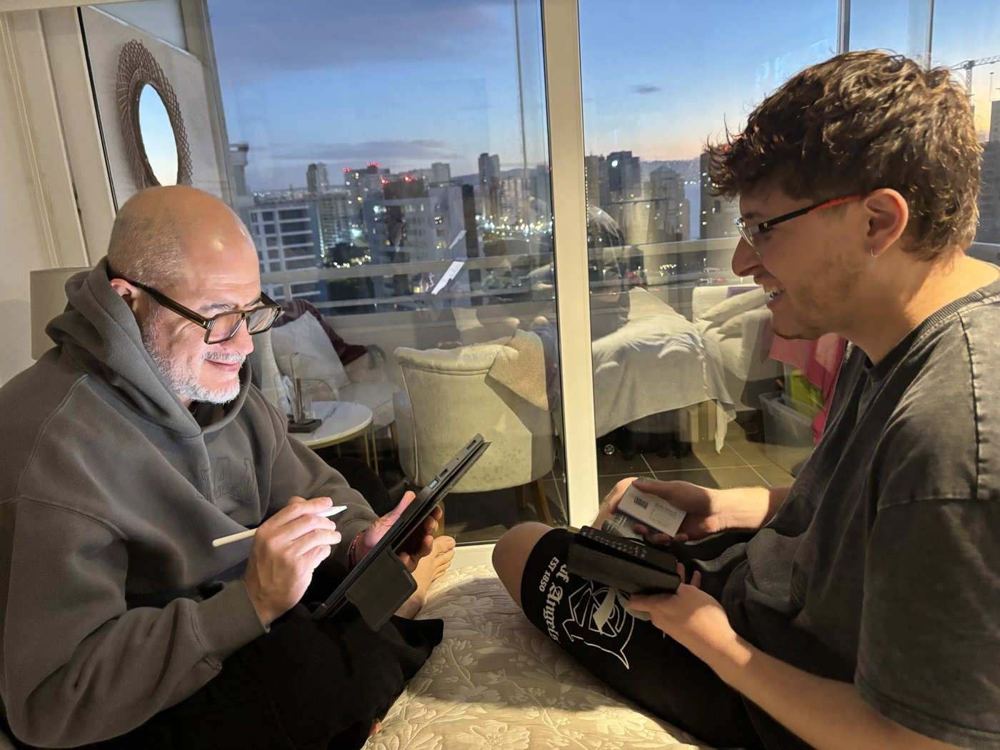
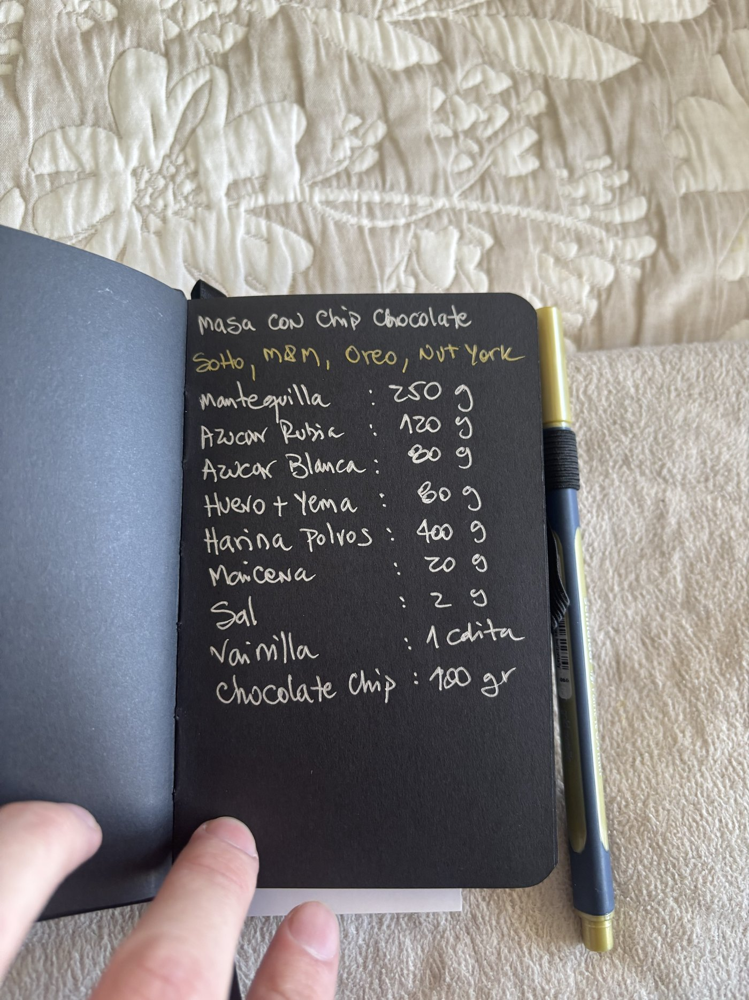
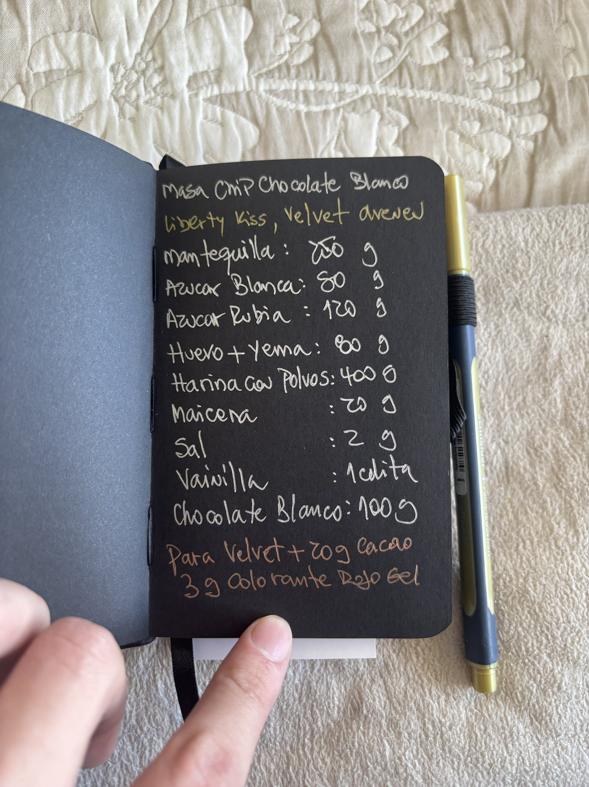
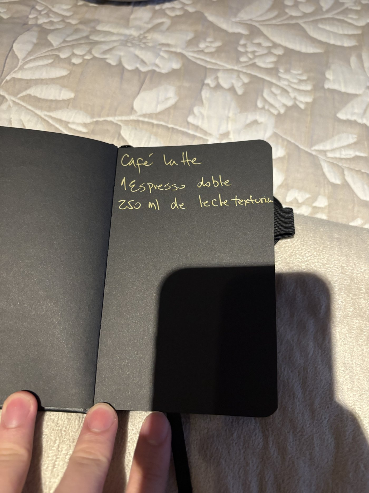
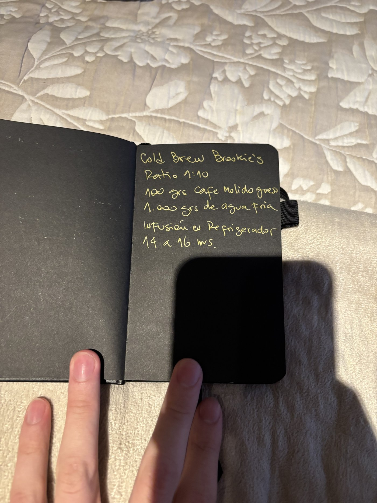
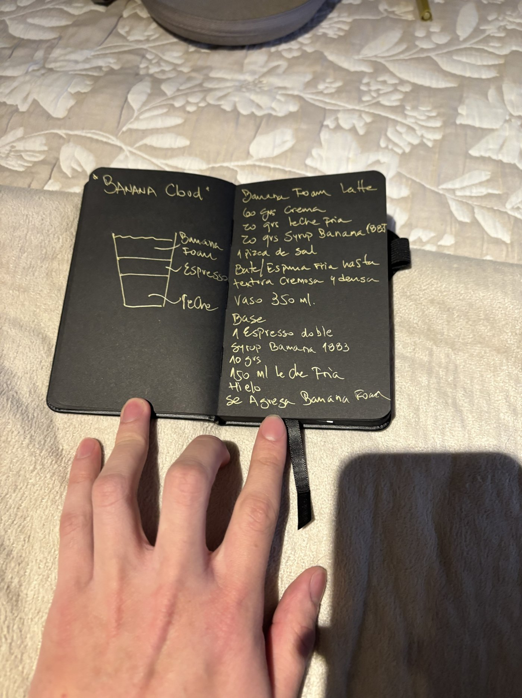
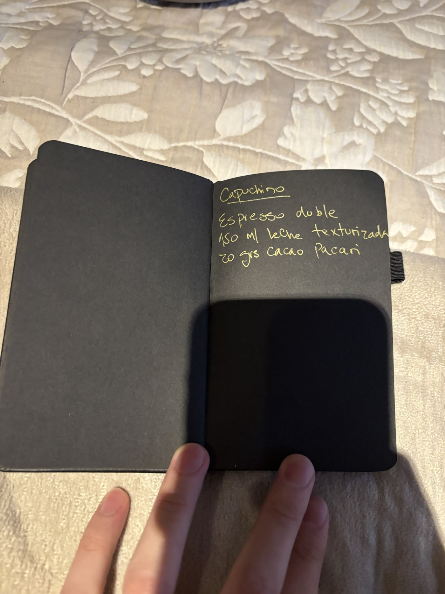

# Elicitación de requisitos

<!-- BORRAR ESTOS COMENTARIOS AL FINALIZAR.
Elicitación completa: evidencia gráfica de ambas técnicas, hallazgos y acta firmada. Pendiente menor: el rendimiento del Cold Brew (cuántas porciones por tanda) no se preguntó. -->

## Técnica 1: Entrevista
- Participante(s): Cristian Hernández, dueño y administrador de Brookies Coffee (cliente del proyecto). Entrevistador y encargado de notas: Felipe Hernández Olivares.
- Fecha y modalidad: 21/09/2026, 14:30 — presencial. Sesión de seguimiento: 21/09/2026, 20:00 — presencial (rendimiento de las recetas y priorización de calidad).
- Evidencia:
  - 
  - 
  - Notas manuscritas de la sesión: [notas de la entrevista y de las recetas](./evidencia/notas-entrevista-y-recetas.pdf)
- Hallazgos principales:

**Problema y objetivos**
- Quiere un sistema que controle el inventario en tiempo real: cada vez que se vende una bebida (café y derivados, más una galleta) debe rebajarse el inventario, y el mismo sistema debe entregar la comanda y mostrar venta y ganancia.
- Lo que más quiere evitar es quedarse sin insumos: al cerrar el día necesita saber qué faltará para el día siguiente.
- Espera que el sistema ayude al personal del salón y a la administración, y poder ver en tiempo real cómo va el negocio por día, semana, mes y año.

**Cómo se hace hoy**
- La rebaja de insumos y las ganancias se llevan a mano, con planillas Excel; las comandas se hacen a mano y la caja se cuadra al final del día.
- El inventario se hace a mano, una vez por semana.
- Compra los insumos cuando baja el stock, donde esté más barato y cada vez que faltan (semanalmente). Cuando hay ofertas compra bastante. El cálculo de cuánto comprar es "al ojo".
- Las pruebas de recetas se anotan a mano en una libreta.
- Ha tenido quiebres de stock por falta de insumos.
- Indica que hoy hace todas las tareas a mano y le gustaría no tener que hacerlas.

**Participantes del proceso**
- Barista y personal de caja; el dueño administra y revisa los insumos.

**Necesidades del administrador**
- Visualizar el stock en tiempo real y recibir un informe al final del día con cuánto se vendió, cuánto stock hay y cuánto se ganó.
- Para decidir cuándo comprar necesita el stock inicial y el stock final del día.
- Lo más urgente es que el sistema le dé "control total".

**Calidad y uso**
- En la sesión de seguimiento, el dueño ordenó de más a menos importante: 1) que el sistema no se caiga, 2) que sea fácil de usar, 3) que sea rápido, 4) que sea seguro.
- Lo usaría desde un computador y esperaría como máximo 1 segundo por respuesta.

**Fuera del alcance de esta entrega**
- Venta, comandas, ganancias y cuadratura de caja fueron mencionadas por el dueño, pero quedan fuera del alcance de esta entrega, centrada en la gestión de inventario y el descuento de insumos por pedido.

## Técnica 2: Revisión documental (recetas)
- Participante(s): Cristian Hernández, dueño de Brookies Coffee (autor de las recetas). Revisión realizada por Felipe Hernández Olivares.
- Fecha y modalidad: 21/09/2026, en la misma sesión que la entrevista — presencial
- Evidencia:
  - 
  - Fotos de las ocho páginas del cuaderno de recetas del dueño:
  - 
  - 
  - 
  - 
  - 
  - 
  - 
  - 
- Hallazgos principales:
  - El cuaderno contiene 4 recetas de masa, cada una usada para varios productos (los nombres indicados bajo el título de cada masa):
    - Masa clásica sin chip: Lemon Empire y Biscoff Central.
    - Masa con chip de chocolate (100 g de chocolate chip): SoHo, M&M, Oreo y Nut York.
    - Masa chip de chocolate blanco (100 g de chocolate blanco): Liberty Kiss y Velvet Avenue. Para Velvet se agregan 20 g de cacao y 3 g de colorante rojo en gel.
    - Masa de pistacho y chocolate blanco (50 g de pistacho y 50 g de chocolate blanco): Pistacho Queens.
  - Las cuatro masas comparten la misma base: mantequilla 250 g, azúcar rubia 120 g, azúcar blanca 80 g, huevo más yema 80 g, harina con polvos 400 g, maicena 20 g, sal 2 g y vainilla 1 cucharadita. Solo cambian los ingredientes agregados.
  - Las recetas describen la masa, no el producto terminado: en el cuaderno no aparecen otros ingredientes de productos como M&M, Oreo o Biscoff.
  - Las cantidades corresponden a una tanda; en la sesión de seguimiento el dueño confirmó que cada receta rinde 10 galletas, de forma pareja entre las 4 masas.
  - Las cantidades están en gramos (escritos como g, gr o gramos), salvo la vainilla, que se mide en cucharaditas.
  - Las cantidades se definieron por prueba y error, y las recetas se ajustan agregando y sacando según la temporada.
  - Hay insumos compartidos entre recetas: los ocho de la base común aparecen en las cuatro masas.
  - Además del cuaderno de masas, el dueño entregó 4 recetas de bebidas, a diferencia de las masas, definidas por unidad vendida (una taza o vaso), no por tanda:
    - Café Latte: 1 espresso doble, 250 ml de leche texturizada.
    - Cold Brew Brookie's: ratio 1:10, 100 g de café molido grueso y 1.000 g de agua fría, en infusión en refrigerador de 14 a 16 horas (rinde varias porciones, no se indica cuántas).
    - Banana Cloud (Banana Foam Latte): base de 1 espresso doble, 10 g de syrup de banana, 150 ml de leche fría y hielo, con una espuma de 60 g de crema, 20 g de leche fría, 20 g de syrup de banana y 1 pizca de sal batida aparte; vaso de 350 ml.
    - Capuchino: espresso doble, 150 ml de leche texturizada, 20 g de cacao Pacari.
  - Las recetas de bebidas sí indican la cantidad exacta por unidad vendida (salvo el Cold Brew, que rinde una tanda para varias porciones), a diferencia de las masas de galletas, que no indican rendimiento.
  - El negocio aún no abre y las recetas siguen en proceso de prueba y ajuste (ver 05, técnica 1, hallazgo "Cómo se hace hoy"); se asume que cualquier receta puede seguir cambiando hasta la apertura, así que no se le preguntó al dueño cuál específicamente cambiaría.

  - Estos hallazgos respaldan los requisitos RP-01, RP-06 y RP-07 y las tablas Receta e Insumo del modelo de datos.

| Insumos y cantidades relevantes | Requisito o dato del modelo que respalda |
|---------------------------------|-------------------------------------------|
| Base común por tanda: mantequilla 250 g, azúcar rubia 120 g, azúcar blanca 80 g, huevo más yema 80 g, harina con polvos 400 g, maicena 20 g, sal 2 g, vainilla 1 cucharadita | RP-01 (descuento según receta), RP-07 (definir receta); tablas Receta e Insumo |
| Ingredientes agregados por masa: chocolate chip 100 g; chocolate blanco 100 g; pistacho 50 g y chocolate blanco 50 g; para Velvet, cacao 20 g y colorante rojo en gel 3 g | RP-07 (una receta por producto, con ingredientes propios sobre una base compartida) |
| Unidades: gramos (g, gr, gramos) y cucharadita para la vainilla | RP-06 (unidad de medida por insumo) |
| Rendimiento confirmado por el dueño: cada receta de masa rinde 10 galletas | RP-01 (descuento por unidad, dividiendo la receta por el rendimiento), RP-07 |

## Acta de acuerdo
**Fecha y modalidad:** 21/09/2026, 14:30, presencial (con sesión de seguimiento el mismo día a las 20:00). **Participantes:** Cristian Hernández, dueño y administrador de Brookies Coffee (entrevistado); Felipe Hernández Olivares (entrevistador y toma de notas).

**Problema identificado:** el control de insumos es manual (inventario semanal a mano, planillas Excel, cálculo de compras "al ojo"), lo que provoca quiebres de stock. Afecta al dueño y administrador y al personal (barista y caja). El objetivo es controlar el inventario en tiempo real, con descuento de insumos en cada venta.

**Participantes del proceso y actividades principales:** dueño y administrador (revisa los insumos, decide y realiza las compras); barista (prepara los productos); personal de caja.

**Requisitos de usuario del administrador:** ver el stock en tiempo real; recibir un informe al final del día (vendido, stock, ganancia); disponer del stock inicial y final del día; tener control total del inventario.

**Prioridades y atributos de calidad:** control total como lo más urgente; evitar caídas del sistema y que sea difícil de usar; uso desde computador; respuesta de hasta 1 segundo.

**Revisión de recetas:** se revisaron 4 recetas de masa y 4 de bebidas del cuaderno del dueño. Las masas comparten una base y se usan para varios productos; están por tanda, en gramos (la vainilla en cucharadita), y el dueño confirmó que cada una rinde 10 galletas. Las bebidas ya están definidas por unidad vendida.

**Temas pendientes:** ninguno relevante a la elicitación queda abierto; cuánto rinde el Cold Brew (menor) sigue sin precisar.

**Confirmación del entrevistado:** confirmada en persona el 21/09/2026. Cristián Hernández leyó este resumen, respondió las preguntas pendientes y firmó el acta impresa (ver [acta firmada](./evidencia/acta-firmada.pdf)).
