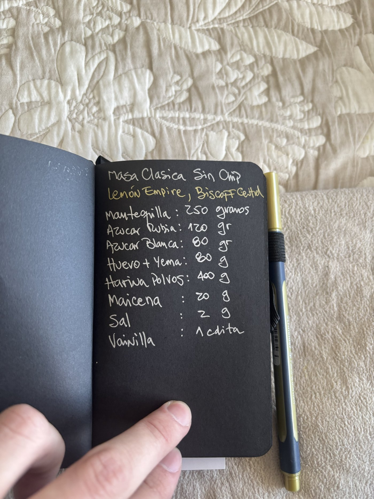
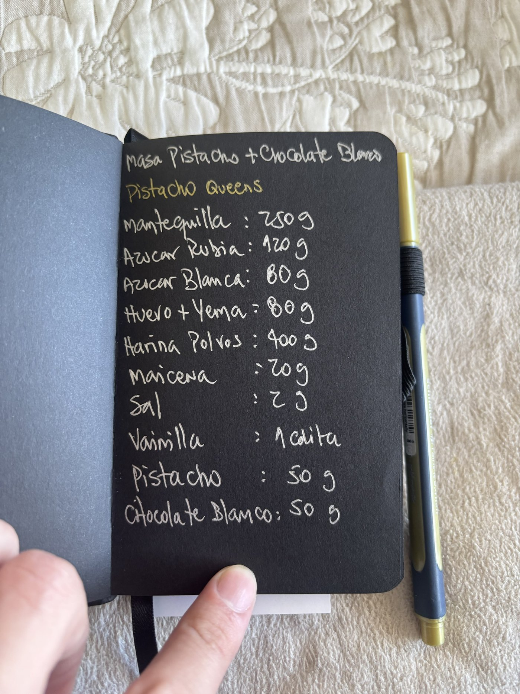

# Elicitación de requisitos

<!-- BORRAR ESTOS COMENTARIOS AL FINALIZAR.
PENDIENTE antes del jueves 10:00:
1) Subir a ./evidencia/ la foto o captura de la entrevista y reemplazar el corchete de "Evidencia" de la Técnica 1. Las fotos de las recetas muestran el cuaderno y una mano, no al dueño: agregar una foto donde aparezca él mostrándolas.
2) Enviar el acta (Acta_sesion_elicitacion_Brookies_Coffee.pdf) al dueño, pedirle que responda "de acuerdo" y guardar la captura en ./evidencia/. Su nombre escrito en la hoja de acta del guion se hizo con el resumen en blanco, así que no confirma el contenido.
3) Confirmar que la modalidad fue presencial y que la revisión de recetas fue en la misma sesión (se asumió así).
4) Preguntar al dueño: (a) cuántas galletas rinde cada masa (sin eso no se puede descontar por unidad vendida); (b) dónde están las cantidades de M&M, Oreo, Biscoff y demás ingredientes agregados, y las recetas de las bebidas (café, leche); (c) cuánto equivale la cucharadita de vainilla en ml o g, porque en la entrevista dijo que todo se mide en gramos y ml; (d) si alguna receta cambiaría al abrir el local.
5) Las preguntas 21 y 22 del guion quedaron sin respuesta: el cierre y la lectura del resumen no están registrados. -->

## Técnica 1: Entrevista
- Participante(s): Cristian Hernández, dueño y administrador de Brookies Coffee (cliente del proyecto). Entrevistador y encargado de notas: Felipe Hernández Olivares.
- Fecha y modalidad: 21/09/2026, 14:30 — presencial
- Evidencia: [foto o captura de la sesión en ./evidencia/]. Notas manuscritas de la sesión, con el nombre del entrevistado escrito en la hoja de acta: [notas de la entrevista y de las recetas](./evidencia/notas-entrevista-y-recetas.pdf)
- Hallazgos principales:

**Problema y objetivos**
- Quiere un sistema que controle el inventario en tiempo real: cada vez que se vende una bebida (café y derivados, más una galleta) debe rebajarse el inventario, y el mismo sistema debe entregar la comanda y mostrar venta y ganancia.
- Lo que más quiere evitar es quedarse sin insumos: al cerrar el día necesita saber qué faltará para el día siguiente.
- Espera que el sistema ayude al personal del salón y a la administración, y poder ver en tiempo real cómo va el negocio por día, semana, mes y año.

**Cómo se hace hoy**
- La rebaja de insumos y las ganancias se llevan a mano, con planillas Excel; las comandas se hacen a mano y la caja se cuadra al final del día.
- El inventario se hace a mano, una vez por semana.
- Compra los insumos cuando baja el stock, donde esté más barato y cada vez que faltan (semanalmente). Cuando hay ofertas compra bastante. El cálculo de cuánto comprar es "al ojo".
- Las pruebas de recetas se anotan a mano en una libreta.
- Ha tenido quiebres de stock por falta de insumos.
- Indica que hoy hace todas las tareas a mano y le gustaría no tener que hacerlas.

**Participantes del proceso**
- Barista y personal de caja; el dueño administra y revisa los insumos.

**Necesidades del administrador**
- Visualizar el stock en tiempo real y recibir un informe al final del día con cuánto se vendió, cuánto stock hay y cuánto se ganó.
- Para decidir cuándo comprar necesita el stock inicial y el stock final del día.
- Lo más urgente es que el sistema le dé "control total".

**Calidad y uso**
- Lo peor sería que el sistema se caiga y que sea difícil de usar.
- Lo usaría desde un computador y esperaría como máximo 1 segundo por respuesta.

**Fuera del alcance de esta entrega**
- Venta, comandas, ganancias y cuadratura de caja fueron mencionadas por el dueño, pero quedan fuera del alcance de esta entrega, centrada en la gestión de inventario y el descuento de insumos por pedido.

## Técnica 2: Revisión documental (recetas)
- Participante(s): Cristian Hernández, dueño de Brookies Coffee (autor de las recetas). Revisión realizada por Felipe Hernández Olivares.
- Fecha y modalidad: 21/09/2026, en la misma sesión que la entrevista — presencial
- Evidencia: fotos de las cuatro páginas del cuaderno de recetas del dueño:
  - 
  - 
  - 
  - 
- Hallazgos principales:
  - El cuaderno contiene 4 recetas de masa, cada una usada para varios productos (los nombres indicados bajo el título de cada masa):
    - Masa clásica sin chip: Lemon Empire y Biscoff Central.
    - Masa con chip de chocolate (100 g de chocolate chip): SoHo, M&M, Oreo y Nut York.
    - Masa chip de chocolate blanco (100 g de chocolate blanco): Liberty Kiss y Velvet Avenue. Para Velvet se agregan 20 g de cacao y 3 g de colorante rojo en gel.
    - Masa de pistacho y chocolate blanco (50 g de pistacho y 50 g de chocolate blanco): Pistacho Queens.
  - Las cuatro masas comparten la misma base: mantequilla 250 g, azúcar rubia 120 g, azúcar blanca 80 g, huevo más yema 80 g, harina con polvos 400 g, maicena 20 g, sal 2 g y vainilla 1 cucharadita. Solo cambian los ingredientes agregados.
  - Las recetas describen la masa, no el producto terminado: en el cuaderno no aparecen otros ingredientes de productos como M&M, Oreo o Biscoff.
  - Las cantidades corresponden a una tanda; el cuaderno no indica cuántas galletas rinde cada masa.
  - Las cantidades están en gramos (escritos como g, gr o gramos), salvo la vainilla, que se mide en cucharaditas.
  - Las cantidades se definieron por prueba y error, y las recetas se ajustan agregando y sacando según la temporada.
  - Hay insumos compartidos entre recetas: los ocho de la base común aparecen en las cuatro masas.
  - Estos hallazgos respaldan los requisitos RP-01, RP-06 y RP-07 y las tablas Receta e Insumo del modelo de datos.

| Insumos y cantidades relevantes | Requisito o dato del modelo que respalda |
|---------------------------------|-------------------------------------------|
| Base común por tanda: mantequilla 250 g, azúcar rubia 120 g, azúcar blanca 80 g, huevo más yema 80 g, harina con polvos 400 g, maicena 20 g, sal 2 g, vainilla 1 cucharadita | RP-01 (descuento según receta), RP-07 (definir receta); tablas Receta e Insumo |
| Ingredientes agregados por masa: chocolate chip 100 g; chocolate blanco 100 g; pistacho 50 g y chocolate blanco 50 g; para Velvet, cacao 20 g y colorante rojo en gel 3 g | RP-07 (una receta por producto, con ingredientes propios sobre una base compartida) |
| Unidades: gramos (g, gr, gramos) y cucharadita para la vainilla | RP-06 (unidad de medida por insumo) |
| El cuaderno no indica cuántas galletas rinde cada masa | RP-01 y RP-07: dato pendiente de confirmar con el dueño |

## Acta de acuerdo
**Fecha y modalidad:** 21/09/2026, 14:30, presencial. **Participantes:** Cristian Hernández, dueño y administrador de Brookies Coffee (entrevistado); Felipe Hernández Olivares (entrevistador y toma de notas).

**Problema identificado:** el control de insumos es manual (inventario semanal a mano, planillas Excel, cálculo de compras "al ojo"), lo que provoca quiebres de stock. Afecta al dueño y administrador y al personal (barista y caja). El objetivo es controlar el inventario en tiempo real, con descuento de insumos en cada venta.

**Participantes del proceso y actividades principales:** dueño y administrador (revisa los insumos, decide y realiza las compras); barista (prepara los productos); personal de caja.

**Requisitos de usuario del administrador:** ver el stock en tiempo real; recibir un informe al final del día (vendido, stock, ganancia); disponer del stock inicial y final del día; tener control total del inventario.

**Prioridades y atributos de calidad:** control total como lo más urgente; evitar caídas del sistema y que sea difícil de usar; uso desde computador; respuesta de hasta 1 segundo.

**Revisión de recetas:** se revisaron 4 recetas de masa del cuaderno del dueño, que comparten una base y se usan para varios productos. Las cantidades están por tanda, en gramos (la vainilla en cucharadita), y el cuaderno no indica el rendimiento de cada masa.

**Temas pendientes:** cuántas galletas rinde cada masa; ingredientes agregados no anotados (M&M, Oreo, Biscoff, otros) y recetas de bebidas; equivalencia de la cucharadita de vainilla; si alguna receta cambiaría al abrir el local; qué parte de venta, comandas y ganancias se aborda en el otro ramo; cómo se registra cada pedido en el módulo de inventario.

**Confirmación del entrevistado:** el entrevistado escribió su nombre en la hoja de acta del guion (ver notas en ./evidencia/). [pendiente: enviar este acta y guardar en ./evidencia/ la captura de su respuesta "de acuerdo"]
